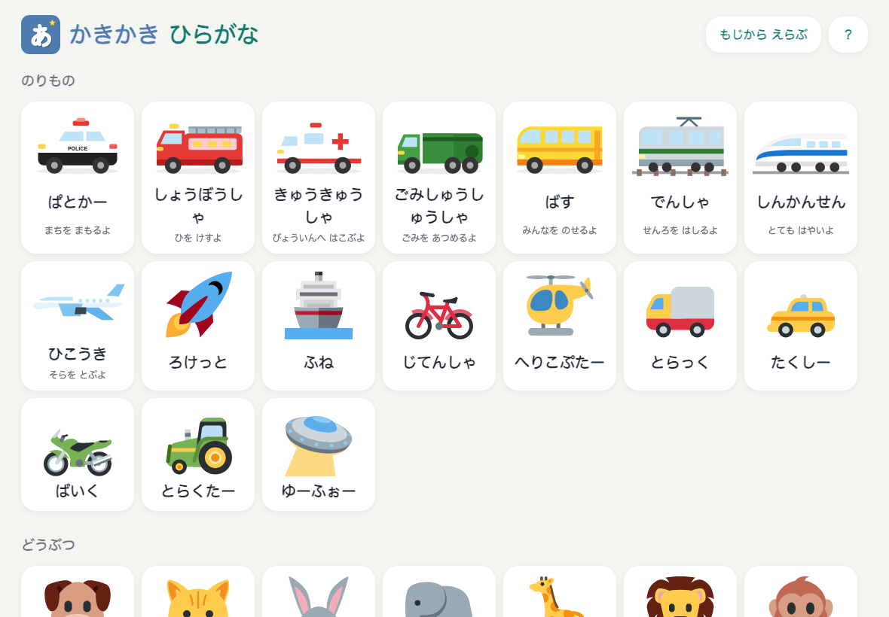
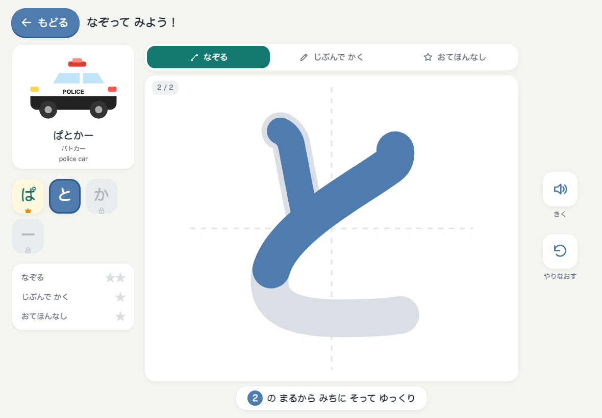

  

  iPad 横画面で使う、子ども向けのひらがな書き練習 PWA。 
  好きな単語を選んで、なぞって、じぶんで書いて、星を集める。

  <a href="https://oekazuma.github.io/kakikaki-hiragana/">https://oekazuma.github.io/kakikaki-hiragana/</a>

---

## 特徴

- **3 つのモード**
  - なぞる: 色のついた丸から書き順どおりに指を動かす。線から外れるとやり直し。
  - じぶんで かく: お手本の上に自由に書く。線の正確さと書き順で星 1〜3 を採点。
  - おてほんなし: 十字のマス目だけで書く。81 文字のお手本と形を照合し、何の文字に見えるかを判定。合格で金の星。
- **200 の単語、9 カテゴリ**: のりもの・どうぶつ・くだもの・やさい・たべもの・しぜん・からだ・みのまわり・あそび。文字一覧からは 81 文字を 1 文字ずつ練習できる。
- **できた！を楽しむ演出**: 画を書き終えるとキラキラ、文字クリアで紙吹雪と星、単語クリアでイラストが画面を走り抜ける。
- **めだる と きろく**: 文字・単語・カテゴリごとの進捗率と、42 個のメダル（行マスター、カテゴリはかせ、練習した日数など）。条件を満たした瞬間に練習画面でお知らせ。
- **読み上げ**: 文字の読みと単語の名前を iPadOS の日本語音声で読み上げ。
- **オフライン・広告なし・アカウントなし**: 練習記録は端末内の保存のみ。リセットは保護者向けの足し算ゲートの先にある。

## iPad で使う

1. Safari で公開 URL を開く
2. 共有 → 「ホーム画面に追加」
3. ホーム画面のアイコンから起動し、横向きで使う

更新を公開したあと、iPad 側は 2 回目の起動で新しい版に切り替わる。

## クレジット

- 書き順データ: [KanjiVG](https://kanjivg.tagaini.net)（CC BY-SA 3.0）
- イラスト: [Twemoji](https://github.com/jdecked/twemoji)（CC BY 4.0）。乗り物 8 種は自作
