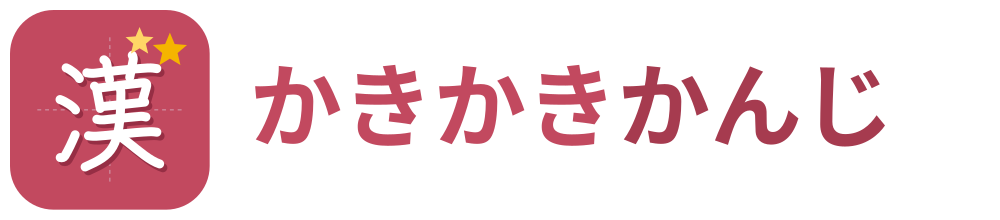
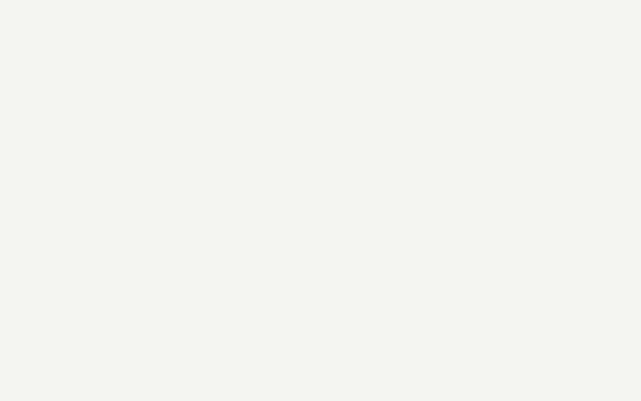

  
  
  
  

  タブレットの横画面で使う、子ども向けの ひらがな・カタカナ・漢字（小学 1〜6 年の 1026 字）・アルファベット 書き練習 PWA（900×520px 以上なら PC のブラウザでも可）。 
  好きな単語を選んで、なぞって、じぶんで書いて、クイズで遊んで、星とメダルを集める。

  <a href="https://oekazuma.github.io/kakikaki/">https://oekazuma.github.io/kakikaki/</a>

  

---

## 特徴

- **きょうだいや大人も、10 人まで**: ホーム左上の顔のボタンで使う人を切り替える。名前とアバター（用意した 25 種の絵（人・どうぶつ・ものなど）か、端末内の写真を丸く切り抜き。切り抜いた写真は一覧に残り、ほかの人も選べる）を設定でき、記録・星・メダル・クイズの成績と、使うことばは人ごとに別に保存。記録のリセット（ことばを選べる）と人の削除は同じ場所にまとめ、保護者向けの掛け算ゲートと最終確認の先。
- **ひらがな・かたかな・かんじ・えいご**: ホーム上部のトグルで切り替え。画面の色（青・緑・赤・オレンジ）が変わり、同じ単語を ひらがな（81 文字）・カタカナ（81 文字）・英語（A〜Z・a〜z の 52 文字。単語は Dog のように先頭が大文字）で練習できる。かんじ（小学 1〜6 年の 1026 字。画面の色は赤）だけは単語ではなく字と読みの練習で、ホームに学年ごとの字のマスと「つづきから」が並び、右端のバーで学年へ飛べる。「よみから さがす」は読みの五十音順の一覧。練習画面では読みごとの「きく」で読みを 1 つずつ聞ける。画数の多い字は線を細く描く。記録・星・メダル・クイズの成績は人ごと・ことばごとに別に保存。
- **3 つのモードで文字ごとに進む**: 単語の文字は左から順に解放され、1 文字ごとに なぞる（2 回）→ じぶんで かく と自動で進む。単語の全文字を終えると完了画面から おてほんなし に挑戦できる。
  - なぞる: 黄色い線が書き順を見せたあと、番号の丸から線に沿って指を動かす。外れると振動してやり直し（かんじ は線から少し外れたり終点の手前で離しても可）。「ひとつ もどる」で直前の画に戻れる。
  - じぶんで かく: 薄いお手本の上を自由に塗る。指を離しても続きが書け、線の正確さで星 1〜3 を採点。
  - おてほんなし: 十字のマス目だけで思い出して書き、お手本と形を照合して何の文字に見えるかを判定。合格で金の星。
  - 右のボタン（きく・みる・ひとつ もどる・やりなおす）はどのモードでも同じ位置。Apple Pencil で書くと筆圧で線の太さが変わる（指では一定）。
- **たくさんの単語をカテゴリから選ぶ**: どうぶつ・しぜん・くだもの・みのまわり・からだ・きもち・ひと・たべもの・あそび・やさい・のりもの（易しい順）。カードには表示していない残り 2 つの表記（例: ひらがな のときは カタカナと英語）を併記。「もじから えらぶ」で 1 文字ずつの練習もできる。ホームの右端のバーでカテゴリへ飛べる。
- **クイズ**: よみクイズ（もじを見てイラストを選ぶ／イラストを見てもじを選ぶ／きいてイラストを選ぶ／「り」で はじまる ものを選ぶ／穴あきの文字を選ぶ、の 5 形式を混ぜて 10 問）と かきクイズ（イラストを見て、聞いて、または単語の 1 文字だけ ？ になった穴埋めを、お手本なしで書く。5 問）。単語の文字数で かんたん・ふつう・むずかしい の 3 段階。かんじ は学年ごとの 6 段階で、よみ（字を見て読みを選ぶ・読みを聞いて字を選ぶ）と かき（読みを見て書く。同じ読みの字はどれでも正解）。
- **めだる と きろく**: 文字・単語・カテゴリごとの進捗率と、たくさんのメダル（行マスター、カテゴリはかせ、クイズ、練習した日数・連続した日数など）。実績画面には今月のカレンダーと「つづけて n にち」。条件を満たした瞬間に練習画面でお知らせ。連続日数など ことば をまたぐメダルは 4 つの ことば で共有し、お知らせは 1 回だけ。
- **できた！を楽しむ演出**: 画を書き終えるとキラキラ、文字クリアで紙吹雪と星、単語クリアでイラストが画面を走り抜けて完了モーダル。
- **読み上げ**: 右の「きく」ボタンでいま書いている 1 文字を、単語カードのスピーカーで単語全体を、端末の音声（日本語／英語）で読み上げ。音声はこれらのボタンでしか流れない。
- **オフライン・広告なし・サーバーなし**: 文字・イラスト・効果音は端末内に保存され、練習記録やアバターの写真も端末内のみ（「アプリについて」から全員分をファイルに書き出し・読み込みできる）。記録の削除は保護者向けの掛け算ゲート（1 日 3 回まで）の先にある。

## タブレットで使う

1. Safari で公開 URL を開く
2. iPad は共有 → 「ホーム画面に追加」、Android は Chrome のメニュー → 「ホーム画面に追加」
3. ホーム画面のアイコンから起動し、横向きで使う（縦向きや小さい画面のときは、タブレットを横にするアニメーションと推奨サイズを案内する）

「アプリについて」（ホーム右上の ? ）は保護者向けのページで、使い方と星・メダルのルール、アプリの状態（ホーム画面から起動しているか、オフライン用の保存ができているか）、「最新版に更新」ボタンがある。新しいバージョンが出るとホーム右上の ? ボタンに赤い丸が付く。通常は 2 回目の起動で切り替わり、すぐ反映したいときは「最新版に更新」を押す。

## ライセンス

コードは [MIT](LICENSE)。書き順データ（`src/lib/strokes.ts`・`strokes-kana.ts`・`strokes-kanji.ts`）は KanjiVG 由来で CC BY-SA 3.0、イラストは Twemoji（CC BY 4.0）、フォントは Klee One（SIL OFL 1.1）で、それぞれ元のライセンスに従う。

## クレジット

- 書き順データ（ひらがな・カタカナ・漢字）: [KanjiVG](https://kanjivg.tagaini.net)（CC BY-SA 3.0）。アルファベットは自作
- 漢字の字と学年: 文部科学省の学年別漢字配当表（2020 年度以降の 1026 字）。読みは代表的なものを選んで収録
- 書く文字のフォント: [Klee One](https://github.com/fontworks-fonts/Klee)（SIL OFL 1.1）。単語カードや文字一覧など書く対象の文字だけ、書き順のお手本と同じ教科書体で表示する（漢字 1026 字は別ファイルにして かんじ の画面でだけ読み込む）
- イラスト: [Twemoji](https://github.com/jdecked/twemoji)（CC BY 4.0）。乗り物 8 種、うどん、かぶとむし、たこ、いか、めろん、つみき、かぼちゃ、うみ は自作
